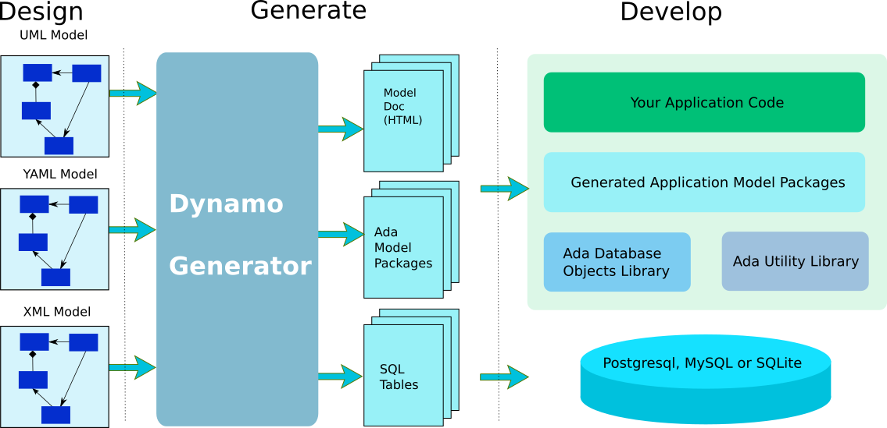

# Introduction

The Ada Database Objects is an Object Relational Mapping for the Ada05 programming language.
It allows to map database objects into Ada records and access database content easily.
The library supports MySQL, SQLite as databases.
Most of the concepts developed for ADO come from the Java Hibernate ORM.

The ORM uses an XML mapping file or an UML model, a code generator and a runtime library for the implementation.  It provides a database driver for [MySQL](http://www.mysql.com/)
and [SQLite](http://www.sqlite.org/).  The ORM helps your application by providing a mapping of your database
tables directly in the target programming language: Ada05 in our case.  The development process is the following:

  * You design your database model either using a UML tool or by writing an XML description,
  * You generate the Ada05 mapping files by using the [Dynamo](https://github.com/stcarrez/dynamo) code generator,
  * You generate the SQL database tables by using the same tool,
  * You write your application on top of the generated code that gives you direct and simplified access to your database.

This document describes how to build the library and how you can use
the different features to simplify and help you access databases
from your Ada application.

